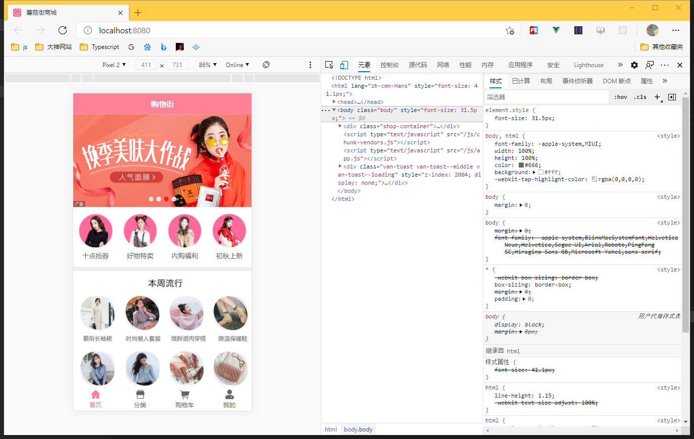
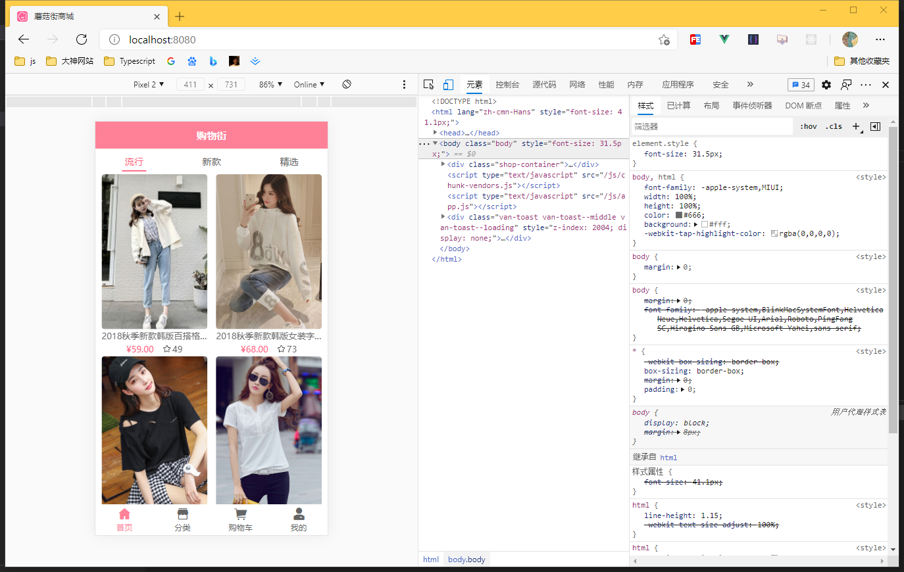
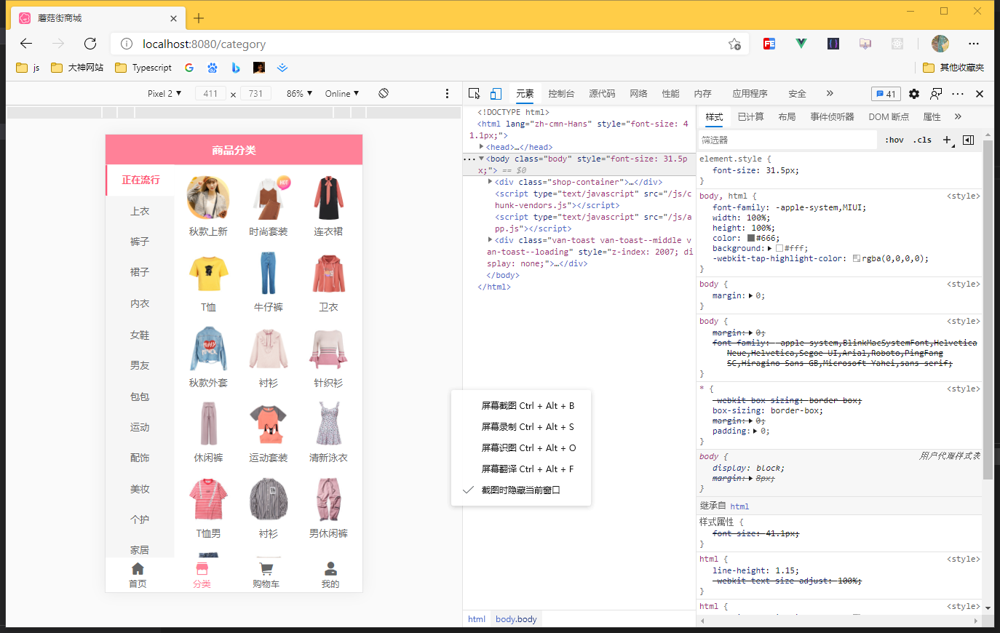

## :pushpin: Vue蘑菇街商城项目

<a href="https://gitee.com/dushenyan/mushroom-street-project.git">:triangular_flag_on_post:项目开放代码</a> 

:warning: 体验时，请尽量不要随意删除数据，谢谢配合！

## :rice_scene: 引言

>此项目经过两番学习，第一次是为了学习Vue，第二次是为了巩固知识并熟练运用，挖掘项目技术亮点，将原本不懂的技术点重新学习，整理一份新的文档。其次，请求比较慢属于正常现象。

### :rainbow: 简单使用方法

    1. `star` 本项目仓库 ^ o ^ 
    2. `fork` 一份本仓库代码
    3. it clone https://gitee.com/dushenyan/mushroom-street-project.git` 拷贝源代码
    4. 执行 `npm install` 安装依赖
    5. `npm run serve`  打开本地服务
    
    注:你所下载来代码中,我没有填写数据请求API,这是属于B站王红元老师的私有品,所以没有公开.
    要想的到Api,请加我的微信或者王红元老师微信coderwhy001即可,成功运行得到真实数据.

## :christmas_tree: 项目概述

### 2.1 商城项目基本业务概述

商城一般都提供了PC端、移动APP、移动Web、微信小程序等多种终端访问方式，我们主要是做关于PC后台管理方面

### 2.2蘑菇街商城的功能

电商后台管理系统有四个主要页面:

 - 首页:用于展示商品推荐数据和商城介绍信息
 - 分类页:包括本商城中的商品,全部分类,更快的帮助用户找到想要商品
 - 购物车页:方便用户保存喜欢的商品
 - 我的页:用户个人的数据信息全部放在这里.

### 2.3蘑菇街商城的开发模式（前后端分离）

蘑菇街商城的开发模式，其中前端项目是基于Vue技术栈的SPA项目。

### 2.4 蘑菇街商城的基本选型

① 前端项目技术栈：

- Vue
- Vue-router
- Vue-Cli
- Bscroll
- Axios

## :heavy_check_mark: 项目部分截图展示

##  :pencil2: 结束语

>学如逆水行舟，不进则退

最后，如果项目和教程对你有所帮助或者你看见了还算比较喜欢，欢迎给我star，谢谢您！

